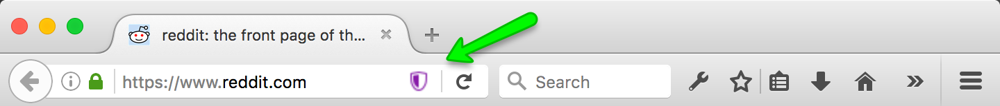
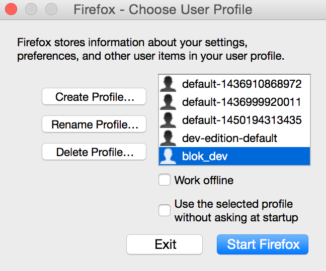

# Tracking Protection: Test Pilot Experiment
## AKA Blok

[Web Extension](https://developer.mozilla.org/en-US/Add-ons/WebExtensions/) re-implementation of [Tracking Protection for Firefox](https://support.mozilla.org/en-US/kb/tracking-protection-pbm).

We will run this add-on thru [Test Pilot experimentation](https://testpilot.firefox.com/experiments) to:

* Measure web content breakage
* Collect user feedback

When we have breakage data and user feedback, we will change the tracking protection implementation, so users get better web experience with tracking protection.

## Requirements

* Firefox 48+

## Run it

1. [Download the latest `.xpi`](https://github.com/mozilla/blok/tree/master/web-ext-artifacts)
2. In Firefox, "Open File" and select the `.xpi`

When the add-on blocks tracker requests, you will see a Tracking Protection pageAction icon:

When you click the icon, you will see a pop-up, so you can report
broken/working pages, or toggle Tracking Protection on or off:

## Development

1. Clone this repo locally
2. `cd blok`
3. `npm install`
4. `npm run bundle`

### Running the Code

This add-on depends on [`web-ext`](https://developer.mozilla.org/en-US/Add-ons/WebExtensions/Getting_started_with_web-ext). Using `web-ext`, start a version of Firefox running the add-on like so:

`./node_modules/.bin/web-ext run --source-dir=src --firefox-binary {path to Firefox 49+ binary}`

### Development Environment

Add-on development is better with [a particular  environment](https://developer.mozilla.org/en-US/Add-ons/Setting_up_extension_development_environment). One simple way to get that environment set up is to install the [DevPrefs add-on](https://addons.mozilla.org/en-US/firefox/addon/devprefs/). You can make a custom Firefox profile that includes the DevPrefs add-on, and use that profile when you run the code in this repository. 

1. Make a new profile by running `{path to Firefox binary} -no-remote -P {new_profile_name}`, which launches the profile editor. "Create Profile" -- name it whatever you wish (e.g. 'blok_dev') and store it in the default location. It's probably best to deselect the option to "Use without asking," since you probably don't want to use this as your default profile.

2. Once you've created your profile, click "Start Firefox". A new instance of Firefox should launch. Go to Tools->Add-ons and search for "DevPrefs". Install it. Quit Firefox.

3. Now you have a new, vanilla Firefox profile with the DevPrefs add-on installed. You can use your new profile with the code in _this_ repository like so:

`./node_modules/.bin/web-ext run --source-dir=src --firefox-binary {path to Firefox 49+ binary} --firefox-profile {new_profile_name}`

Check out the [Browser Toolbox](https://developer.mozilla.org/en-US/docs/Tools/Browser_Toolbox) for more information about debugging add-on code.

## Testing

Requires node 6+

`npm test`

## Distributing

To distribute, you will need AMO access credentials. See the `web-ext` docs.

1. Use [`web-ext
   sign`](https://developer.mozilla.org/en-US/Add-ons/WebExtensions/web-ext_command_reference#web-ext_sign)

## Footnotes, Appendices, etc.

### Running the addon from source without `web-ext`

1. Go to `about:config` and set `xpinstall.signatures.required` to `false`
2. Go to `about:debugging`
3. Click "Load Temporary Add-on"
4. Select this repo's `src/manifest.json` file
